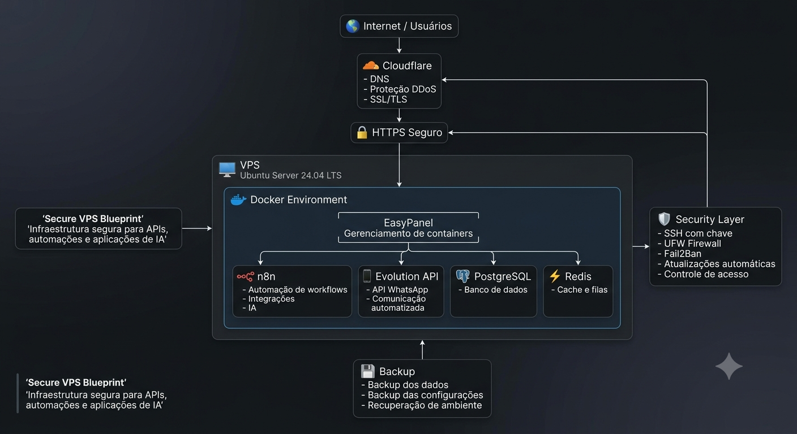

# 🛡️ Secure VPS Blueprint

Documentação da construção de uma VPS segura para hospedar APIs, automações e aplicações de IA, seguindo boas práticas de DevSecOps e cibersegurança.

---

# 🎯 Objetivo

Este repositório documenta minha jornada de aprendizado na construção de uma infraestrutura segura, desde a criação da VPS até sua preparação para produção.

Além de servir como material de estudo, este projeto funciona como um portfólio técnico, registrando cada etapa, as decisões tomadas e as boas práticas aplicadas.

---

# 🏗️ Stack

- Ubuntu Server 24.04 LTS
- Docker
- Docker Compose
- EasyPanel
- Cloudflare
- PostgreSQL
- Redis
- n8n
- Evolution API

## 📚 Documentação

O projeto foi dividido em 14 etapas:

1. Preparação da VPS
2. Acesso seguro SSH
3. Firewall UFW
4. Fail2Ban
5. Atualizações automáticas
6. Docker e EasyPanel
7. Cloudflare e domínio
8. HTTPS automático
9. Isolamento por cliente
10. Bancos de dados
11. n8n e Evolution API
12. Backup
13. Camada contratual
14. Manutenção contínua

A documentação completa está disponível na pasta:

[/docs](./docs)

---

# 📋 Roadmap

- [x] Ativar 2FA na Hostinger
- [x] Ativar 2FA na Cloudflare
- [x] Gerenciador de senhas na Bitwarden
- [x] Configurar acesso seguro via SSH
- [x] Configurar Firewall (UFW)
- [x] Instalar Fail2Ban
- [x] Configurar atualizações automáticas
- [x] Instalar Docker
- [x] Instalar EasyPanel
- [x] Configurar Cloudflare
- [x] Configurar HTTPS
- [x] Instalar PostgreSQL
- [x] Instalar Redis
- [x] Instalar n8n
- [x] Instalar Evolution API
- [x] Configurar backups
- [x] Cláusulas Contratuais — Infraestrutura e Dados
- [x] Rotina de manutenção contínua

---

# 📚 Documentação

Cada etapa deste projeto será documentada contendo:

- Objetivo
- Motivação
- Tecnologias utilizadas
- Passo a passo
- Como validar a configuração
- Lições aprendidas

